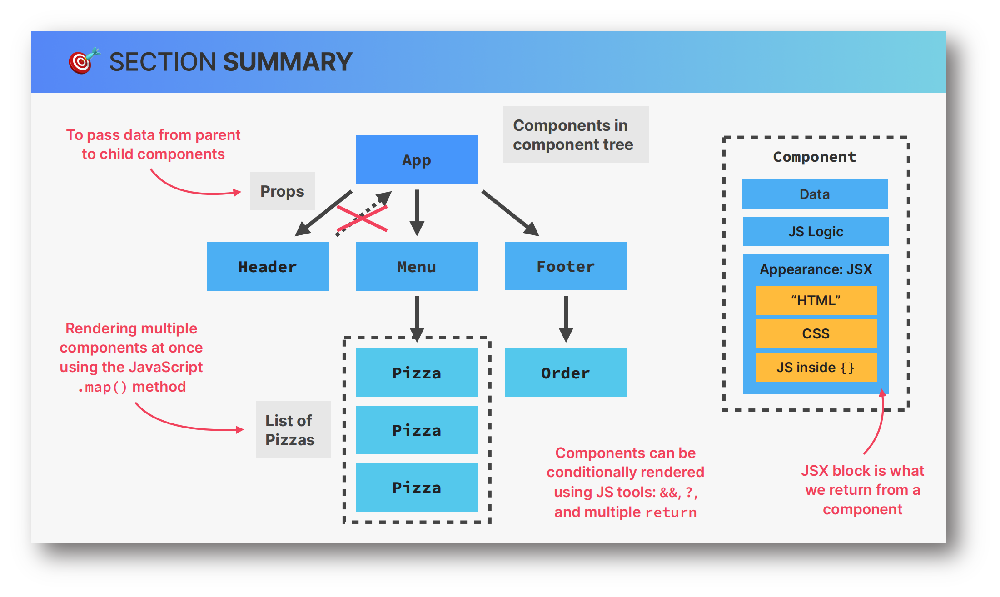

## Pizza Menu Project - A very simple base react project

### Preview image

## The key knowledge points I use

- Props
- Rendering Lists: map method
- Conditional Rendering with ternaries / multiple returns
- Destructuring
- React Fragments

### Project Structure

