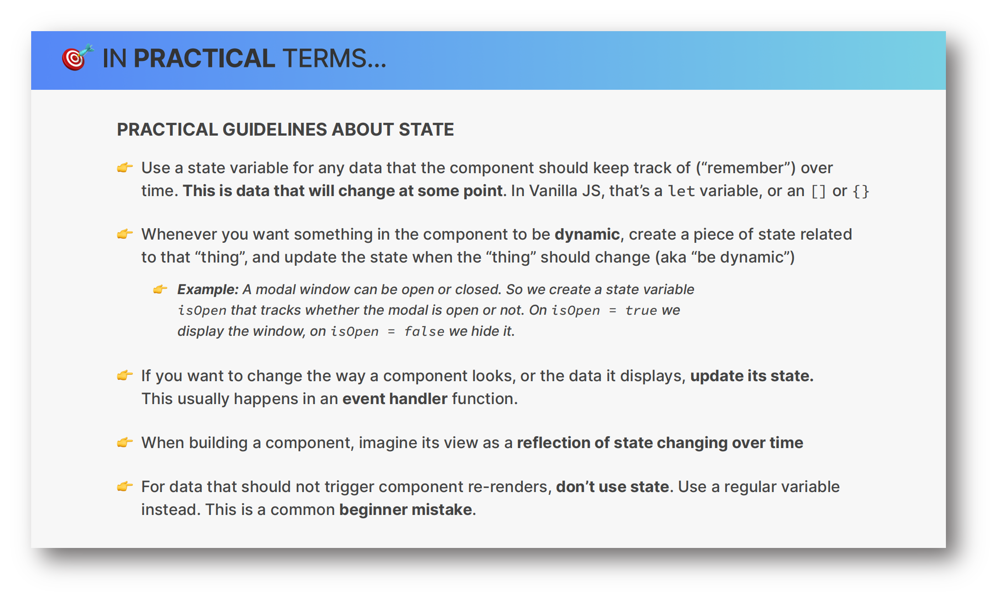
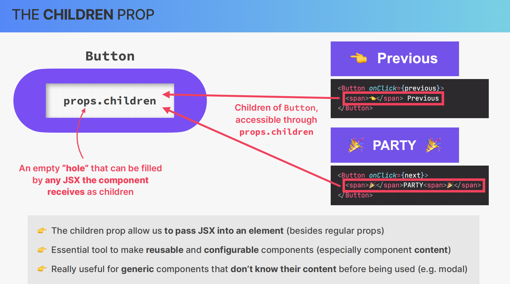

## Pizza Menu Project - A very simple base react project

### Preview image

There is a vanilla.html file in public folder as reference!

## The key knowledge points I use

- Handling events
- State to update the UI
- Building forms the "React way"
- Controlled elements
- The children prop

What is state?

How to use state in practice?
useState
useReducer
Context API

The children prop

