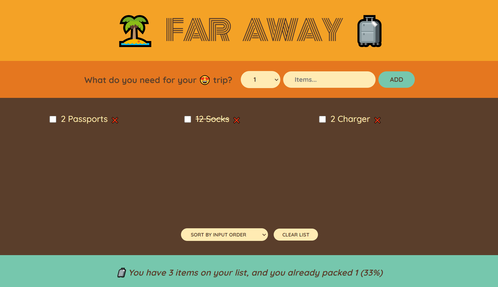

## Travel List Project - A very simple base react project

### Preview image

## The key knowledge points I use

### The method of passing data to sibling component:

lift up state: move the code of defining state to the closest common parent component

### Chilf-to-Parent Communication

The solution is to pass the set coupons function down as a prop to the components who need to update the state
parent ---setCoupons()---> child
