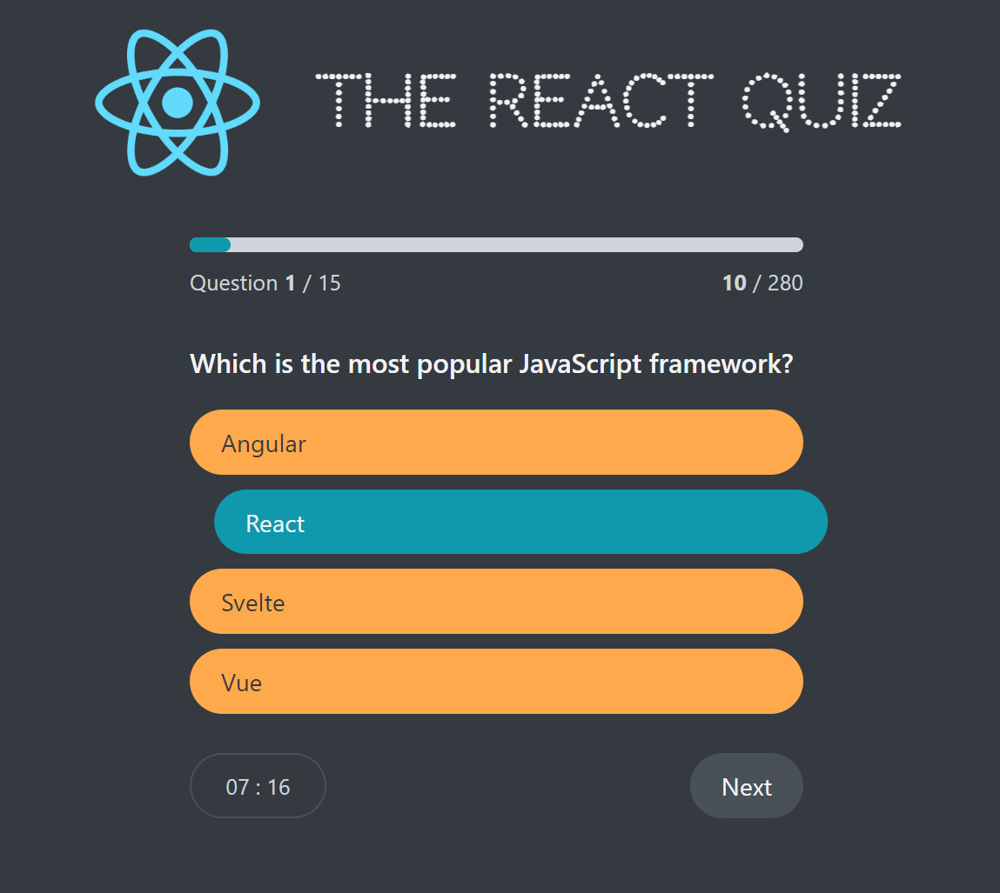

# Awesome React projects

## Getting Started with Create React App

This project was bootstrapped with [Create React App](https://github.com/facebook/create-react-app).

1. In the project directory, run `npm install` to install all dependencies and packages

2. run `npm start` to start the server

3. Open [http://localhost:3000](http://localhost:3000) to view it in your browser.

---

## PIZZA MENU

## Travel List

## UsePopcorn

## The React Quiz

## Worldwise - todo
