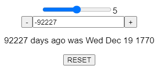

## UPDATING...

**Before starting to use this project, I recommend you to read [JavaScript 2h quick recap](https://github.com/luomi16/My-Blog/blob/main/JS/Essential-JavaScript-Fundamentals.md) and [React Learning NOTES (UPDATING)](https://github.com/luomi16/My-Blog/blob/main/JS/React.md)**

#### Getting Started with Create React App

This project was bootstrapped with [Create React App](https://github.com/facebook/create-react-app).

#### Available Scripts

In the project directory, you can run: `npm install` and `npm start`

Runs the app in the development mode.

Open [http://localhost:3000](http://localhost:3000) to view it in your browser.

## First project Preview image: PIZZA MENU

### A small challenge: PROFILE CARD

Type `new react` in your bowser search input, you can create easily a new react project in **codesandbox**

[ANSWER CODE OF PROFILE CARD](https://codesandbox.io/s/react-challenge-profile-j2sszk)

## Second project Preview image: Steps

### A small challenge: Date Counter(v1)

[ANSWER CODE OF DATE COUNTER](https://codesandbox.io/s/date-counter-rtyvjs)

## Third project Preview image: Travel List

### A small challenge: Flashcard

[ANSWER CODE OF FLASHCARD](https://codesandbox.io/s/flashcard-92jqg7)

### A small challenge: Date Counter(v2) - Use controlled element to update

[ANSWER CODE OF DATE COUNTER](https://codesandbox.io/s/flashcard-92jqg7)

They are from [Jonas's course at the udemy](https://www.udemy.com/course/the-ultimate-react-course/learn/lecture)
